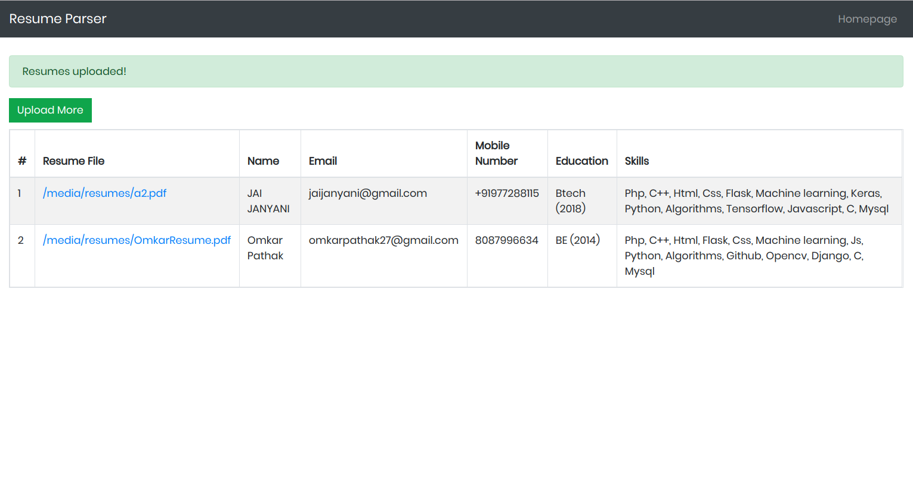

# ResumeParser
A  Resume Parser used for extracting information from Resumes/CVs

bash
```
python resume_parser/manage.py makemigrations
python resume_parser/manage.py migrate
python resume_parser/manage.py runserver
```

- Visit `127.0.0.1` to view the GUI

# Working:



# Running app in Docker

- Install docker-compose
- Execute the following commands from the root of the project
    - Build our images

        `docker-compose build`

    - Starting our containers and services

        `docker-compose up -d`

- Visit `localhost:8080` in your browser to run the app

# Result

The module would return a list of dictionary objects with result as follows:

```
[
    {
        'education': [('Uni', '2014')],
        'email': 'abcd@gmail.com',
        'mobile_number': '9030030303',
        'name': 'John Doe',
        'skills': [
            'Flask',
            'Django',
            'Mysql',
            'C',
            'Css',
            'Html',
            'Js',
            'Machine learning',
            'C++',
            'Algorithms',
            'Github',
            'Php',
            'Python',
            'Opencv'
        ]
    }
]
```

# To DO

- [x] Extracting Experience
- [ ] Extracting Projects
- [ ] Extracting hobbies
- [ ] Extracting universities
- [ ] Extracting month of passing
- [ ] Extracting Awards/ Achievements/ Recognition
